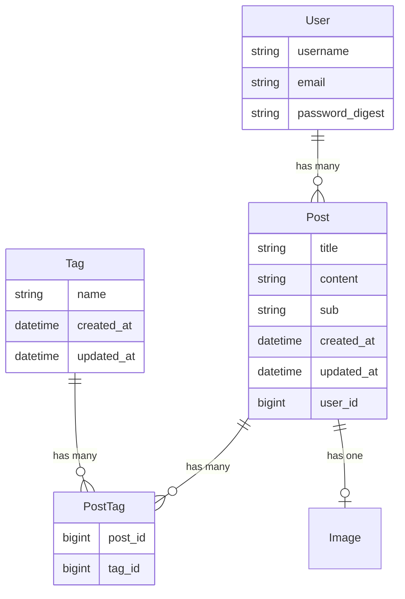

# 課題
Ruby on RailsとVue.jsを用いたブログプラットフォームを構築していただきます。

# **課題の説明**
1. ブログ記事の管理
<ul>
 <li>記事の投稿、編集、削除機能をRailsで実装。</li>
 <li>記事にカテゴリやタグを関連付けるリレーションを構築。</li>
</ul>

2.検索・フィルタリング機能
<ul>
 <li>Vue.jsを用いて、記事をカテゴリごとにフィルタリングし、検索できる機能を実装。</li>
</ul>

3.ユーザー認証機能
<ul>
 <li>Railsで簡易的なログイン/ログアウト機能を追加。</li>
</ul>

4.レスポンシブデザイン
<ul>
 <li>フロントエンドでモバイル対応のデザインを適用。</li>
</ul>

5.任意項目（追加要素）
<ul>
 <li>単体テストまたはE2Eテストを導入。</li>
 <li>デプロイ手順のドキュメント化。</li>
</ul>

# Xlog - ブログプラットフォーム

Vue.jsとRuby on Railsを使用したブログプラットフォームプロジェクトです。

## 目次
1. [技術スタック](#技術スタック)
2. [主要機能](#主要機能)
3. [プロジェクト構造](#プロジェクト構造)
4. [機能別コード実装](#機能別コード実装)
5. [インストールと実行方法](#インストールと実行方法)
6. [API仕様書](#api仕様書)

## 技術スタック

### フロントエンド
- Vue.js 3 (Composition API)
- Vue Router
- JWT認証
- FormDataの処理

### バックエンド
- Ruby on Rails (APIモード)
- Active Storage (画像処理)
- JWT認証
- PostgreSQL

## 主要機能

### 1. ユーザー管理
- JWT基盤の認証
- ログイン/ログアウト
- ユーザー権限管理
- セキュリティ処理

### 2. 投稿管理
- CRUD (作成、読み取り、更新、削除)
- 画像アップロード
- タグシステム
- 権限基盤の投稿管理

### 3. 検索システム
- 統合検索（タイトル、タグ）
- リアルタイム検索UI
- 検索結果ページ
- タグベースのフィルタリング

## 機能別コード実装

### 1. ユーザー認証システム

#### バックエンド (AuthController)
```ruby
module Api
  class AuthController < ApplicationController
    def login
      user = User.find_by(email: params[:email])
      
      if user&.authenticate(params[:password])
        token = JWT.encode(
          { user_id: user.id, exp: 24.hours.from_now.to_i },
          Rails.application.credentials.secret_key_base
        )
        render json: { 
          status: 'success',
          token: token,
          user: { email: user.email }
        }
      else
        render json: { 
          status: 'error', 
          message: 'ログインに失敗しました' 
        }, status: :unauthorized
      end
    end
  end
end
```

#### フロントエンド (LoginModal)
```javascript
export default {
  setup(props, { emit }) {
    const email = ref('');
    const password = ref('');

    const handleLogin = async() => {
      try {
        const res = await authApi.login(email.value, password.value);
        if(res.data.status === 'success') {
          localStorage.setItem('token', res.data.token);
          emit('login-success');
          emit('close-login');
        }
      } catch(err) {
        console.error("エラー:", err);
        error.value = 'ログインに失敗しました'
      }
    };
  }
}
```
#### API通信層 (auth.js)
```javascript
 axios.interceptors.request.use(
  config => {
    const token = localStorage.getItem('token');
    if (token) {
      config.headers.Authorization = `Bearer ${token}`;
    }
    return config;
  },
  error => {
    return Promise.reject(error);
  }
);

export const authApi = {
  login: (email, password) => {
    return axios.post('http://localhost:3000/api/login', { email, password });
  },

  logout: () => {
    localStorage.removeItem('token');  
    return axios.post('http://localhost:3000/api/logout');
  },

  me: () => {
    return axios.get('http://localhost:3000/api/me');
  }
};
```
#### 認証状態管理 (useAuth Composable)
```javascript
 export function useAuth() {
  const isLoggedIn = ref(false);
  const isLoginModalOpen = ref(false);
  const currentUser = ref(null);

  const checkAuth = async () => {
    try {
      const token = localStorage.getItem('token');
      if (token) {
        const res = await authApi.me();
        if (res.data.status === 'success') {
          isLoggedIn.value = true;
          currentUser.value = res.data.username || res.data.user?.username;
          console.log('설정된 currentUser:', currentUser.value);
        }
      }
    } catch (error) {
      console.error('인증 확인 실패:', error);
      localStorage.removeItem('token');
      isLoggedIn.value = false;
      currentUser.value = null;
    }
  };

  const handleLoginSuccess = () => {
    isLoggedIn.value = true;
    isLoginModalOpen.value = false;
    checkAuth();
  };

  const handleLogout = async () => {
    try {
      const response = await authApi.logout();
      if (response.data.status === 'success') {
        isLoggedIn.value = false;
        currentUser.value = null; 
      }
    } catch (error) {
      console.error('로그아웃 실패:', error);
    }
  };

  return {
    isLoggedIn,
    isLoginModalOpen,
    currentUser, 
    checkAuth,
    handleLoginSuccess,
    handleLogout
  };
}
```

### 2. 投稿CRUD

#### バックエンド (PostsController)
```ruby
module Api
  class PostsController < ApplicationController
    before_action :authenticate_user, only: [:create, :update, :destroy]
    before_action :set_post, only: [:show, :update, :destroy]
    before_action :check_post_owner, only: [:update, :destroy]
 
    def create
      @post = Post.new(post_params.except(:tags))
      @post.user = current_user
      @post.date = Date.today
      
      if @post.save
        if params[:post][:tags].present?
          params[:post][:tags].each do |tag_name|
            tag = Tag.find_or_create_by(name: tag_name)
            @post.tags << tag
          end
        end
        render json: @post, status: :created
      else
        render json: { error: @post.errors.full_messages }, 
               status: :unprocessable_entity
      end
    end

    def update
      if params[:post][:tags].present?
        @post.tags.clear
        
        new_tags = params[:post][:tags].map do |tag_name|
          Tag.find_or_create_by(name: tag_name)
        end
        
        @post.tags = new_tags
      end
    
      if @post.update(post_params.except(:tags))
        render json: @post
      else
        render json: { error: @post.errors.full_messages }, 
               status: :unprocessable_entity
      end
    end

    def destroy
      @post.destroy
      head :no_content
    rescue ActiveRecord::RecordNotFound
      render json: { error: '投稿が見つかりません' }, 
             status: :not_found
    end

    private

    def set_post
      @post = Post.find(params[:id])
    end

    def check_post_owner
      unless @post.user_id == current_user&.id
        render json: { error: "この操作を実行する権限がありません" }, 
               status: :forbidden
      end
    end

    def post_params
      params.require(:post).permit(:title, :sub, :content, :image, tags: [])
    end
  end
end
```

#### フロントエンド (投稿の作成と編集)
```javascript
// WriteView.js - 投稿作成
export default {
  name: 'WriteContent',
  setup() {
    const title = ref('');
    const content = ref('');
    const tags = ref([]);
    const image = ref(null);

    const publish = async () => {
      try {
        const formData = new FormData();
        formData.append('post[title]', title.value);
        formData.append('post[content]', content.value);
        
        const sub = content.value.length > 100 
          ? content.value.substring(0, 100) + "..."
          : content.value;
        
        formData.append('post[sub]', sub);
        
        if (image.value) {
          formData.append('post[image]', image.value);
        }

        tags.value.forEach(tag => {
          formData.append('post[tags][]', tag);
        });
    
        await postsApi.createPost(formData);
        router.push('/');
      } catch (error) {
        console.error('投稿の作成に失敗しました:', error);
      }
    };
  }
}

// EditView.js - 投稿編集
export default {
  name: 'EditView',
  setup() {
    const route = useRoute();
    const router = useRouter();
    const title = ref('');
    const content = ref('');
    const tags = ref([]);
    const image = ref(null);

    const fetchPost = async () => {
      try {
        const response = await postsApi.getPost(route.params.id);
        const post = response.data;
        title.value = post.title;
        content.value = post.content;
        tags.value = post.tags || [];
      } catch (error) {
        console.error('投稿の読み込みに失敗しました:', error);
      }
    };

    const handleUpdate = async () => {
      try {
        const formData = new FormData();
        formData.append('post[title]', title.value);
        formData.append('post[content]', content.value);
        formData.append('post[sub]', content.value.substring(0, 100) + "...");
        
        if (image.value) {
          formData.append('post[image]', image.value);
        }

        tags.value.forEach(tag => {
          formData.append('post[tags][]', tag);
        });

        await postsApi.updatePost(route.params.id, formData);
        router.push(`/posts/${route.params.id}`);
      } catch (error) {
        console.error('投稿の更新に失敗しました:', error);
      }
    };

    onMounted(fetchPost);

    return {
      title,
      content,
      tags,
      handleUpdate
    };
  }
}

// DetailView.js - 投稿削除
export default {
  setup() {
    const handleDelete = async () => {
      if (window.confirm('本当に削除しますか？')) {
        try {
          await postsApi.deletePost(post.value.id);
          router.push('/');
        } catch (error) {
          console.error('投稿の削除に失敗しました:', error);
        }
      }
    };
  }
}
```

### 3. 検索システム

#### バックエンド (検索ロジック)
```ruby
def search
  keyword = params[:keyword]
  @posts = Post.joins(:tags)
               .where("posts.title LIKE ? OR tags.name LIKE ?", 
                     "%#{keyword}%", "%#{keyword}%")
               .distinct
  render json: @posts
end
```

#### フロントエンド (検索実装)
```javascript
export default {
  setup(props, { emit }) {
    const searchKeyword = ref('');
    const isSearchExpanded = ref(false);

    const searchPosts = () => {
      if (searchKeyword.value.trim() !== '') {
        router.push(`/search?keyword=${encodeURIComponent(searchKeyword.value)}`);
        searchKeyword.value = '';
        isSearchExpanded.value = false;
      }
    };

    const handleKeyDown = (e) => {
      if (e.key === 'Escape' && isSearchExpanded.value) {
        isSearchExpanded.value = false;
        searchKeyword.value = '';
      }
    };
  }
}
```

## データベース構造



## コードレビューポイント

### 1. セキュリティ
- [x] ユーザー認証の実装
- [x] 権限チェックの実装
- [x] JWTトークン管理

### 2. パフォーマンス
- [x] 画像処理の最適化
- [x] 検索クエリの最適化
- [ ] N+1クエリ問題の解決が必要

### 3. ユーザー体験
- [x] 検索UI/UX
- [x] レスポンシブデザイン
- [x] エラー処理とフィードバック

## 今後の改善点
1. 検索パフォーマンスの最適化
   - 全文検索エンジンの導入検討
   - キャッシュの適用
2. テストコードの作成
3. CI/CDパイプラインの構築
